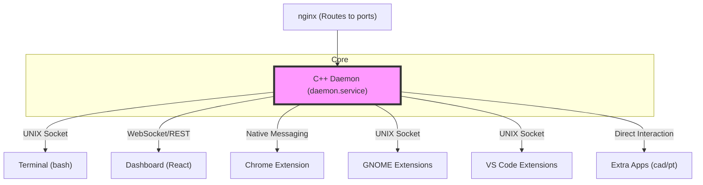

# AutomateLinux

This repository contains a comprehensive suite of tools designed to enhance the Linux user experience through automation, input mapping, and cross-application state synchronization.

## Project Overview

automateLinux is a suite of tools for personalizing and automating a Linux desktop environment:
- **C++ Daemon** (`daemon/`): Central background service managing input events, port registry, database state, and command dispatching via UNIX sockets.
- **Terminal Environment** (`terminal/`): Modular Bash scripts for shell customization including shared directory history (`Ctrl+Up/Down`), custom prompt, aliases, and functions.
- **Dashboard** (`dashboard/`): React/Vite web app for live logs, macro builder, and system configuration.
- **Chrome Extension** (`chromeExtensions/daemon/`): Browser state sync via Native Messaging (tracks active tabs, Ctrl+V focus+paste on ChatGPT).
- **GNOME Extensions** (`gnomeExtensions/`): Desktop integration - status menu for daemon control, active window tracking.
- **VS Code Extensions** (`visualStudioCodeExtensions/`): Editor integrations for daemon monitoring, git workflows, and log viewing.
- **Utilities** (`utilities/`): Standalone tools - termcontrol, sendKeysUInput, lastChanged, cleanBetween, emergencyRestore.sh.
- **Extra Apps** (`/opt/dev/`): Standalone applications as separate git repos (cad, publicTransportation, dashboard, immersiveRDP). Dev at `/opt/dev/<app>`, prod at `/opt/prod/<app>`.

## Build Commands

### Daemon (C++)
```bash
bd                    # Build daemon from anywhere (preferred)
```
The `bd` function changes to daemon dir, runs `source ./build.sh`, and returns. The build stops the service, compiles with CMake, deploys the binary, and restarts `daemon.service`.

### Dashboard
```bash
node dashboard/bridge.cjs &                      # Start bridge (port 3501)
cd dashboard && npm run dev -- --port 3007       # Start frontend (port 3007)
```

### Extra Apps (CAD, PT)
```bash
# CAD Frontend
cd /opt/dev/cad/web && npm run dev -- -p $(d getPort --key cad-dev)
```

## Port Management

The daemon is the central authority for port assignments. 

### Current Port Registry
| Key | Port | Description |
| :--- | :--- | :--- |
| cad-prod | 3000 | CAD app production |
| cad-dev | 3001 | CAD app development |
| pt-prod | 3002 | Public Transportation production |
| pt-dev | 3003 | Public Transportation development |
| pt-proxy | 3502 | Public Transportation MOT SSH Proxy |
| dashboard-prod | 3006 | Dashboard frontend production |
| dashboard-dev | 3007 | Dashboard frontend development |
| dashboard-bridge | 3501 | Dashboard daemon bridge |

## Daemon Communication

```bash
d <command>                  # Send command (shorthand, auto-prepends 'send')
d help                       # List available commands

# Common commands
d ping
d listPorts
d enableKeyboard / disableKeyboard
d simulateInput --string "text"
d simulateInput --type 1 --code 30 --value 1   # Raw key event (EV_KEY, KEY_A, press)
d publicTransportationOpenApp
d registerLogListener                           # For live log streaming
```

## Architecture



## Key Concepts

1. **Native Messaging**: High-performance communication between the browser and the local daemon.
2. **Input Mapping**: Intercepting and transforming hardware input events (keyboard/mouse) based on application context.
3. **Shared History**: A global directory navigation sequence shared across all terminal sessions.

## App-Specific Documentation

Some applications have their own dedicated documentation:
- **CAD**: [GEMINI.md](file:///opt/dev/cad/GEMINI.md)

## Environment Variables

All prefixed with `AUTOMATE_LINUX_`:
- `AUTOMATE_LINUX_DIR` - Root project directory
- `AUTOMATE_LINUX_SOCKET_PATH` - Daemon socket (`/run/automatelinux/automatelinux-daemon.sock`)
- `AUTOMATE_LINUX_DATA_DIR` - Persistent data directory
- `AUTOMATE_LINUX_DAEMON_DIR` - Daemon source directory
- `AUTOMATE_LINUX_TERMINAL_FUNCTIONS_DIR` - Terminal function scripts

## Emergency Recovery

If daemon crashes while holding input devices:
```bash
./utilities/emergencyRestore.sh
```
